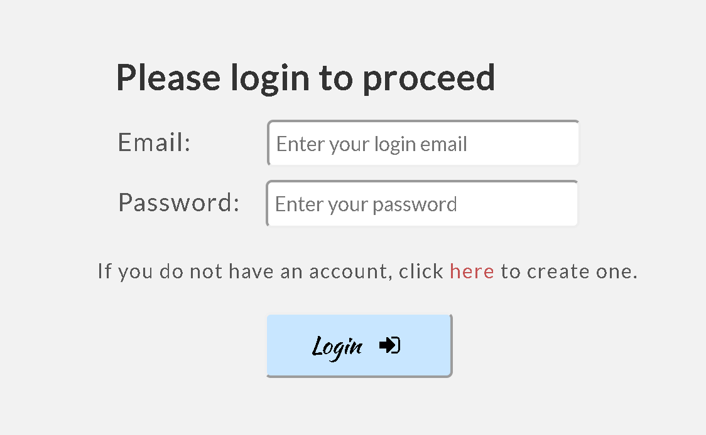
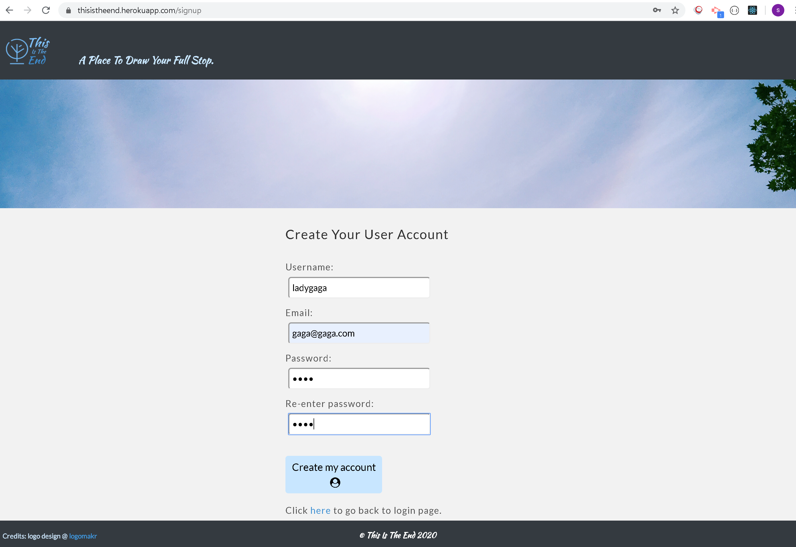
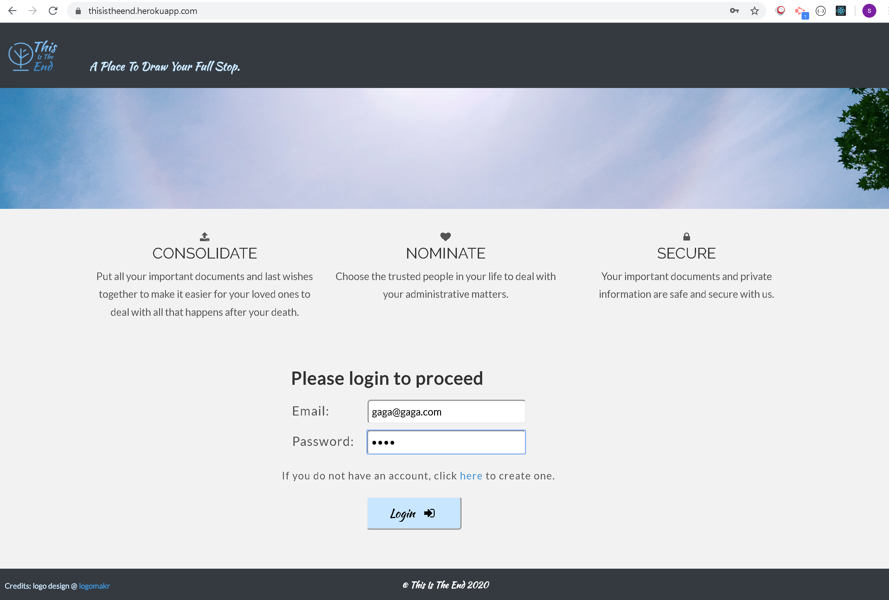
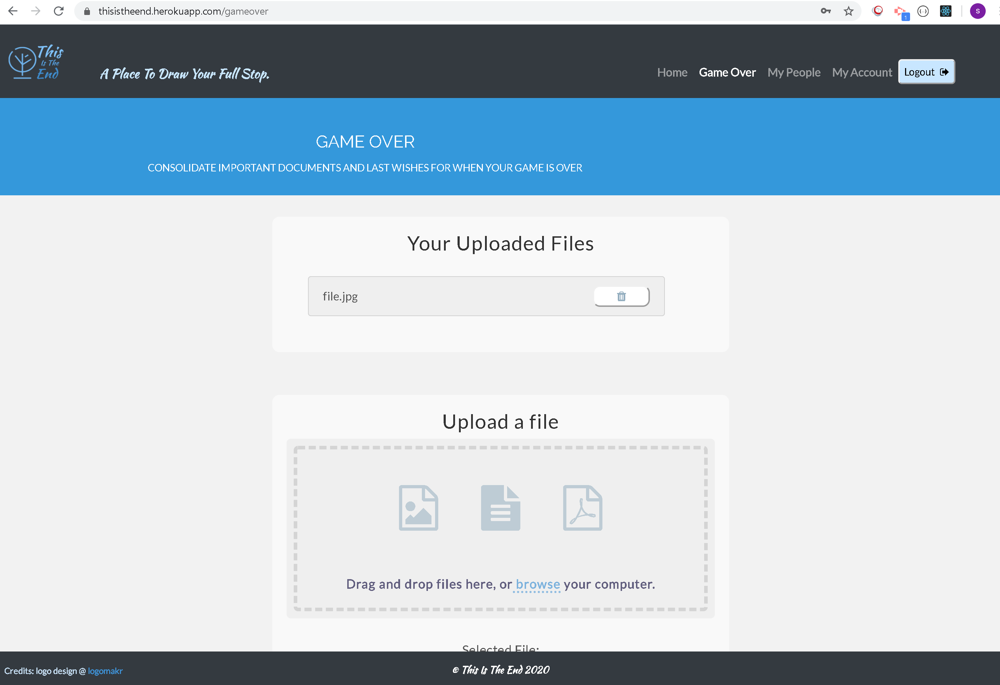

# solo-thisistheend

+ Github link: https://github.com/sevenspell/solo-thisistheend

+ Deployed Heroku Link: https://thisistheend.herokuapp.com/

## Description 

This MERN Stack Application is titled 'This Is The End'. The purpose of this application is to provide people who wish to consolidate important documents, last wishes, or even choose their own funeral photo, and have these known to trusted people (known as Nominees in the app). This enables their Nominees to be able to come together and tie up loose ends, without having to panic on where to find their will, banking details, insurance policies etc.

## App functions
It contains the following functions:
+ User Signup
+ User Login / Authentication
+ File Upload to cloud storage
+ Nominee detail upload
+ Ability to change password and username after signup

For future enhancements:
+ Email Verification: User to receive an email to validate their account at point of sign up
+ User File Upload: User to be able to tag Nominees in file upload which will be used to restrict view settings of Nominees
+ Nominee Account: 
++ Nominee to receive an email to create an account to view User's documents 
++ Nominee's view to be restricted according to file upload tags but not immediately visible
++ Nominee to be able to create their own User account and have distinction between User/Nominee functions
+ Death Verification: 
++ Any Nominee to log in and click a button to confirm death. This will send notification to all Nominees for them to login and verify. 
++ Only after all Nominees have verified would uploaded files be made visible to  them according to tags.

This front-end client-side only application was built using React, React Components, useState, and JSX amongst other React functionalities.

## Technology Used
+ Framework: Mongoose, Express, React, Node.js (MERN Stack)
+ Design: Bootstrap CSS
+ User Authentication: Passport / Session / bcryptjs / jsonwebtoken
+ File Upload: Express-Formidable, AWS S3, React-Dropzone
+ Security: dotenv

## Usage 

1. Go to deployed Github app link: https://thisistheend.herokuapp.com/

2. Click on 'here' to go to Signup page.

3. Enter details to create a new user account and click on 'Create my account' button. It will bring you back to login page.

4. Enter login details and click on the 'Login' button. It will bring you to the 'gameover' page to upload files.

5. It will show a list of already uploaded files.

6. Click on 'browse' to select a file or just drag and drop a file into the box. Then select a category and click on 'Upload File' button.

7. As a user, you won't be able to see this but the file will be uploaded onto the AWS S3 cloud storage.

8. Next, go to 'mypeople' page. This is for you to enter details of trusted people you want to select as Nominees. It will show you a list of Nominees you have already entered.

9. Scroll down to enter another Nominee and click on the 'Submit' button.

10. It will update the Nomination List on top.

11. You can also delete any of the Nominees by clicking on the 'trash can' button and the Nomination List will be updated.

12. Go to 'myaccount' page, and you will see your account details. You can choose to change username or password.

13. Click on the 'logout' button once you're done and it will bring you back to the home page.

## Credits
I got a deeper understanding of the MERN stack from Wagner (https://wagner-lopes.github.io/) and a lot of guidance and help from Jack Song (https://sk8.tech).